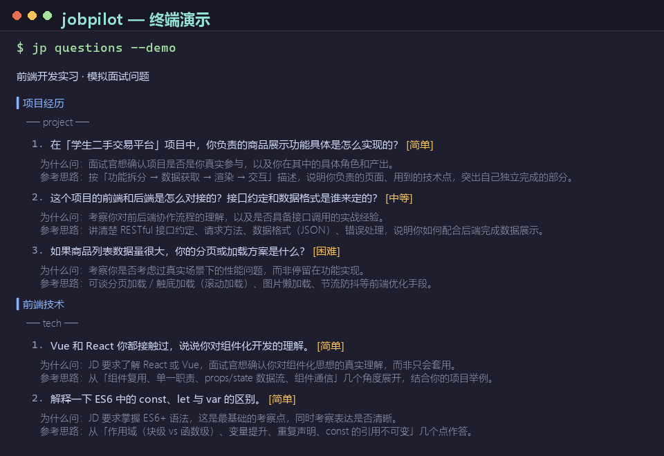

# JobPilot（jp）

> 面向求职者的 CLI 工具：根据**岗位 JD** 自动生成**定制简历**，并据此生成**模拟面试问题**——自带「为什么问」和「参考答案思路」。



[](LICENSE)


投简历前最费时的是两件事：**把简历改得贴合 JD**，以及**猜面试官会问什么**。这个工具用大模型把这两件都自动化了：

- `jp resume <jd>` —— 从 JD 生成一份**理想候选人简历模板**，或基于你的**现有简历合并改写**成匹配版
- `jp questions <resume> <jd>` —— 生成 12–15 个贴合你真实情况的面试问题，每题附「为什么问 + 参考答案思路」

相当于请了一位 24 小时在线的**求职顾问 + 模拟面试官**。

---

## 特性

- ✅ **简历定制**：从 JD 提炼关键词，生成模板或改写现有简历，自动标注「待补充项」
- ✅ **基于真实材料出题**：面试问题只围绕简历和 JD 里真实出现的内容，不编造
- ✅ **四类问题**：项目经历 / 前端技术 / 行为面试 / 岗位匹配，覆盖面试全维度
- ✅ **每题带解析**：为什么问 + 参考答案思路 + 难度标注
- ✅ **差距提示**：自动指出简历与 JD 的差距，帮你针对性补强
- ✅ **无需 API key 也能体验**：内置 `--demo` 演示模式，离线跑通全流程
- ✅ **可替换模型**：基于 Vercel AI SDK，一套代码支持 DeepSeek / OpenAI 等

## 快速开始

### 1. 演示模式（无需 API key）

```bash
# 面试问题演示
jp questions --demo

# 简历演示（模板）
jp resume --demo

# 简历演示（基于示例简历合并改写）
jp resume --demo examples/resume.md
```

### 2. 真实使用

```bash
# 准备文件：jd.md（目标岗位 JD）、resume.md（你的简历，可选）

# 从 JD 生成简历模板（联系方式为占位符，需自行替换）
jp resume jd.md --out resume-matched.md

# 基于你的现有简历，合并改写成匹配版（推荐）
jp resume jd.md resume.md --out resume-matched.md

# 用生成的简历 + JD 生成面试问题
jp questions resume-matched.md jd.md --out interview-questions.md
```

> 首次运行后可用 `npm link` 将 `jp` 安装为全局命令。

## 命令一览

```
jp resume [jd] [resume]                生成简历
  --demo                               演示模式：内置示例数据，无需 API key
  --key <key>                          API key（默认读 .env 或 DEEPSEEK_API_KEY）
  --provider <deepseek|openai>         模型提供商，默认 deepseek
  --out <file.md>                      输出文件路径，同时保存为 Markdown
  # 无 [resume] → 从 JD 生成理想候选人模板
  # 有 [resume] → 保留真实事实，按 JD 关键字改写/强调匹配

jp questions [resume] [jd]            生成面试问题
  --demo / --key / --provider / --out  （同上）
```

## 配置

在项目根目录创建 `.env`（参考 `.env.example`）：

```
DEEPSEEK_API_KEY=sk-xxxxxxxxxxxxxxxx
```

- **DeepSeek**：到 [platform.deepseek.com](https://platform.deepseek.com) 申请，默认模型 `deepseek-chat`
- **OpenAI**：`--provider openai`，默认模型 `gpt-4o-mini`

## 工作原理

```
                ┌── 简历模板（无 resume 参数）
                │
JD (jd.md) ────┤── 合并改写（有 resume 参数）──► LLM（DeepSeek/OpenAI/Mock）──► 简历 JSON
                │                                                              │
                └── 与 resume.md 一起 ──► LLM ──► 面试问题 JSON ──► 本地校验 ──► 渲染/保存
```

- **LLM 层**：通过 [Vercel AI SDK](https://sdk.vercel.ai) 统一接口调用，`src/llm.ts` 中一个 `MockProvider` 实现演示模式——完整走通「Prompt → LLM → 解析 → 输出」管线，但不发任何网络请求。
- **简历合并**：Prompt 强制「只改写结构措辞，不虚构经历」，JD 要求但简历缺失的点写入 `gapNotes`（待补充项），不硬编进简历正文。
- **约束出题**：面试问题的关键字必须出自简历或 JD，避免模型编造经历。
- **结构校验**：`src/prompt.ts` 的 `parseQuestionsJson` / `parseResumeJson` 在本地严格校验 LLM 返回的 JSON，失败给出可读错误。

## 项目结构

```
├── src/
│   ├── index.ts          # CLI 入口（commander，双命令分发）
│   ├── args.ts           # 参数解析与校验
│   ├── read-input.ts     # 读取简历 / JD 文件
│   ├── prompt.ts         # Prompt 构建（问题 + 简历）+ JSON 校验
│   ├── llm.ts            # AI SDK 调用 + MockProvider（演示模式）
│   ├── demo-data.ts      # 演示数据（示例简历/JD/预置输出）
│   ├── output.ts         # 终端渲染 + Markdown 保存（问题 + 简历）
│   ├── run.ts            # 命令主流程（questions / resume）
│   └── types.ts          # 类型定义（GeneratedQuestions / GeneratedResume）
├── examples/             # 示例简历、JD、输出
├── README.md
├── LICENSE               # MIT
└── CONTRIBUTING.md
```

## FAQ

**Q：没有 API key 能用吗？**
可以。`jp questions --demo` / `jp resume --demo` 用内置演示数据 + 预置输出完整跑通流程，无需任何 key。

**Q：`jp resume` 生成的简历能直接投吗？**
`jp resume jd.md` 生成的是**理想候选人模板**，联系方式为占位符，需要你替换为真实信息后再投；`jp resume jd.md resume.md` 基于你的真实简历改写，更贴近实际，但仍建议人工校对后再投递。

**Q：会编造我的经历吗？**
不会。合并改写模式的 Prompt 明确禁止虚构经历，只优化结构、措辞与匹配重点；JD 要求但简历缺失的点会写进「待补充项」，由你自己决定是否补充。

**Q：能换其他模型吗？**
能。本项目基于 Vercel AI SDK，支持 OpenAI 兼容接口的模型。加 provider 只需在 `src/llm.ts` 增加一条配置。

**Q：简历 / JD 支持什么格式？**
支持 `.txt` / `.md` / `.markdown`。粘贴任意文本到文件即可。

## 贡献

欢迎提交 Issue 和 PR，详见 [CONTRIBUTING.md](CONTRIBUTING.md)。

## License

[MIT](LICENSE)
